# Equipment required

- Safety glasses - **springs are under tension and may fly off mounts during assembly**.
- Bit driver with 2.5mm hex bit
- Side cutters

# Assembly Instructions

## Snap parts off circuit board

Carefully snap off the following parts from the circuit board:

1. Edge rails. These can be discarded
2. Spring retainer. Install this into the enclosure's slot to keep safe, and set aside.

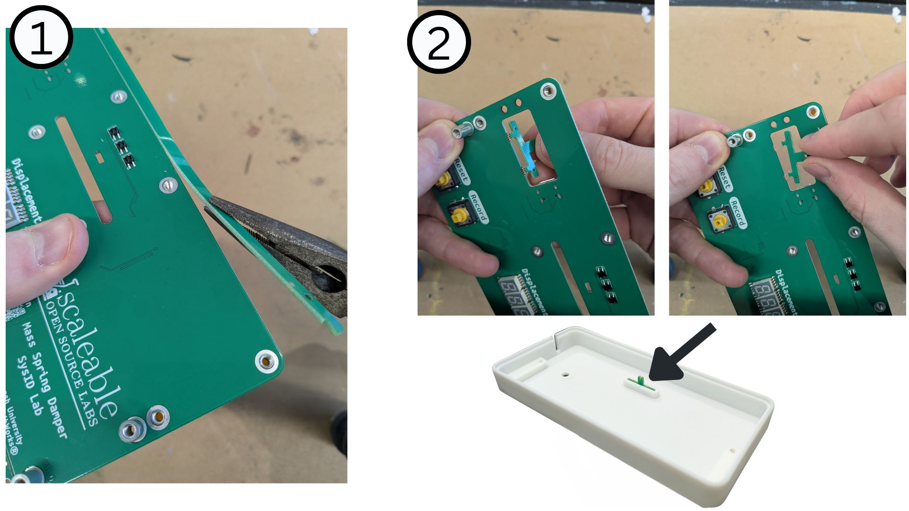

## Mount guides

Use 6x M3x8mm screws to secure the guides to the circuit board. Both guides are identical.
Ensure the arrows point upwards.

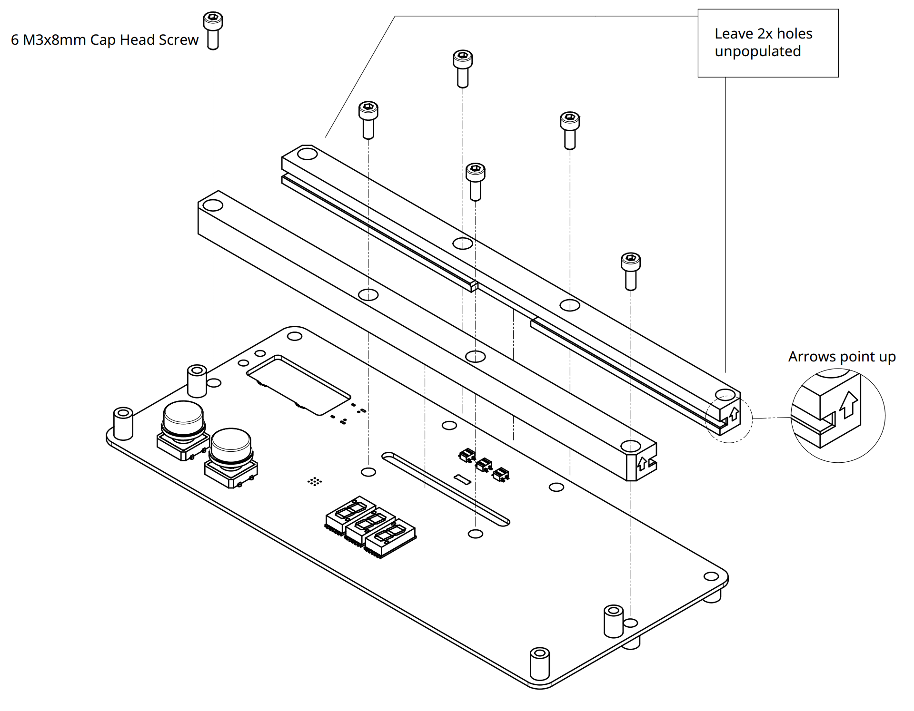

## Install Carriage

- Slide the carriage into the guides. Ensure orientation of carriage graduation numbers is correct.
- Centre the carriage and install the knurled screw. This will capture the carriage and prevent it falling out. Pliers may be helpful for torquing the screw. Consider adding a tiny drop of superglue or blue Loctite to prevent screw from loosening.

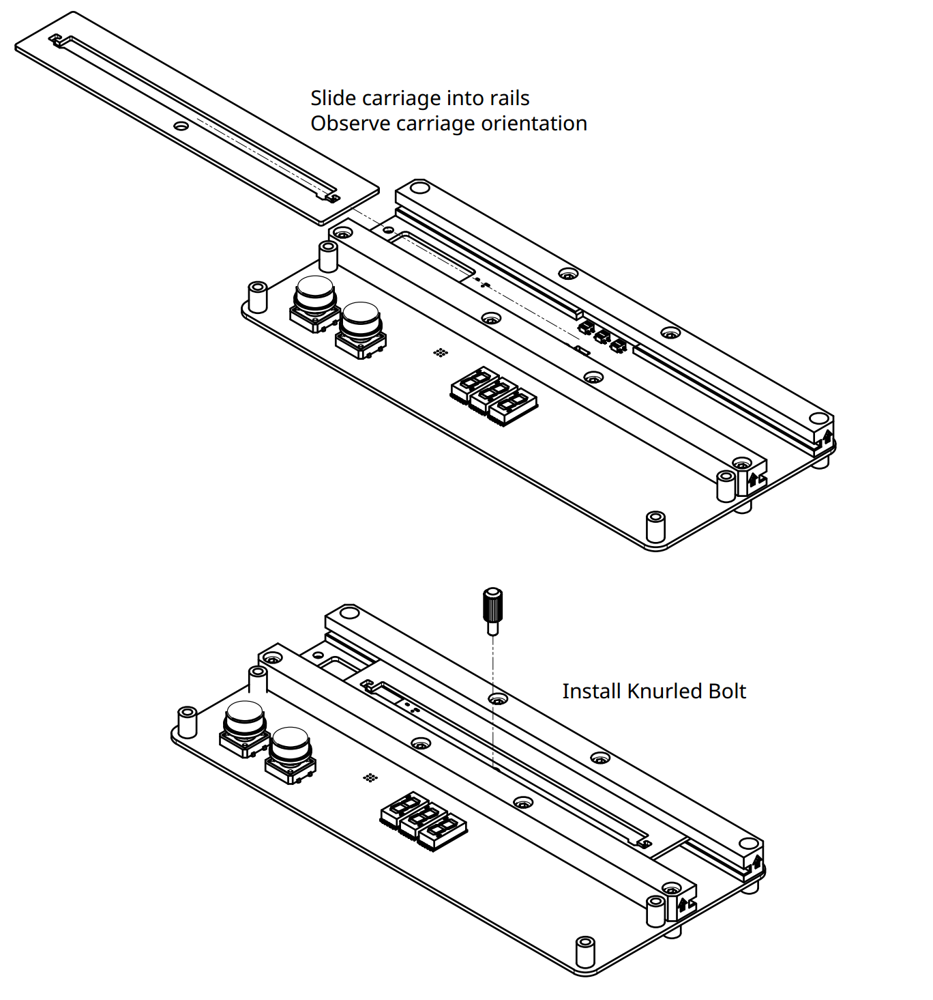

## Fix USB cable to circuit board

1. Plug one end of a USB-C cable into the circuit board.
2. Secure with a cable tie. The locking mechanism must be located on the same side of the circuit board as the USB connector.
3. Trim excess.
4. Ensure that no sharp plastic remains.

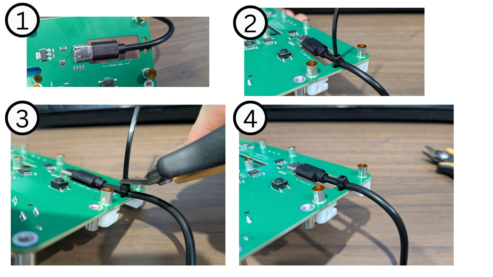

## Mount circuit board into enclosure

Carefully snap out the cable blanking plate and set aside.

Insert the circuit board into the enclosure:
- Guide the spring retainer through the rectangular hole in the circuit board.
- Seat the USB cable into the cable slot

Use 4x M3x8mm screws to secure circuit board into enclosure

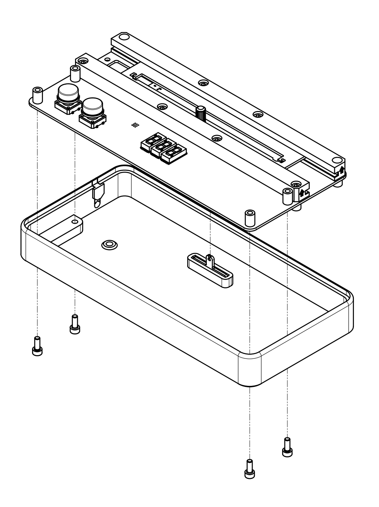

## Install springs

**Springs are under tenstion - eye protection must be worn until completion of assembly**

1. Loop one end of a spring to the left carriage hook. This is easiest when approaching from above.
2. Draw slight tension into the spring and hook the other end onto the spring retainer.
3. There will be slight tension in the spring to keep it in position.

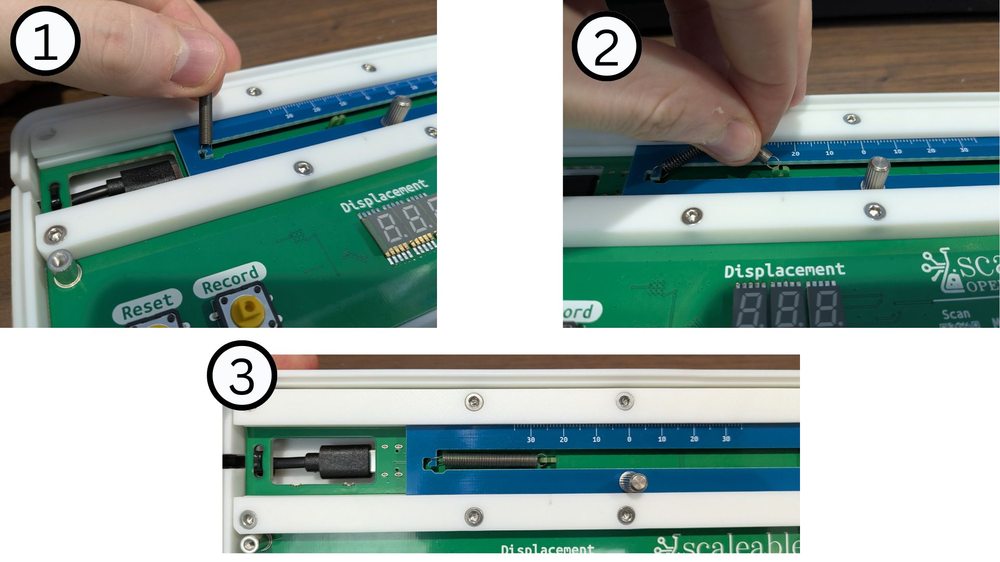

Repeat the process with the second spring, at the second carriage hook.

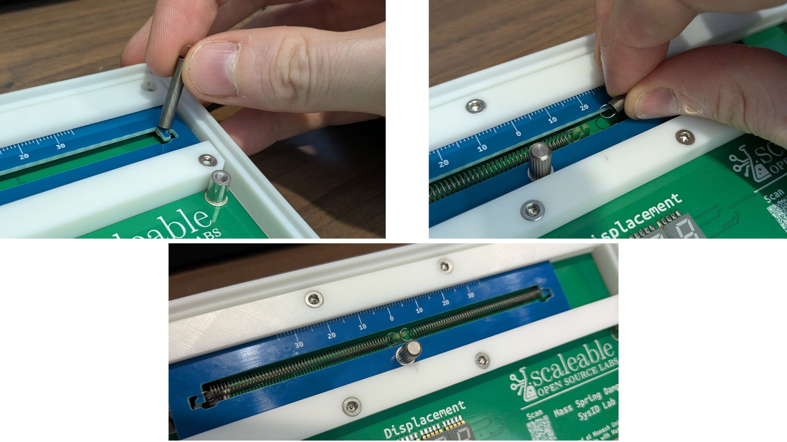

## Install Coloured Button Caps

Push the coloured button caps onto the buttons - they will click into place.

- **Reset** button is White
- **Record** button is Red

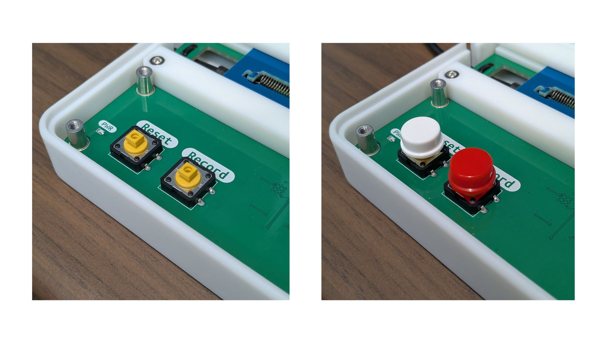

## Mount Cable Blanking Plate and Lid

- Feed the cable blanking plate into position. It will be retained by the lid, once secured.
- Seat the lid into the enclosure, taking care to capture the cable blanking plate correctly.
- Fasten the lid with 2x M3x16mm and 2x M3x8mm screws
- Check the buttons clear the lid and their action is not impeded.

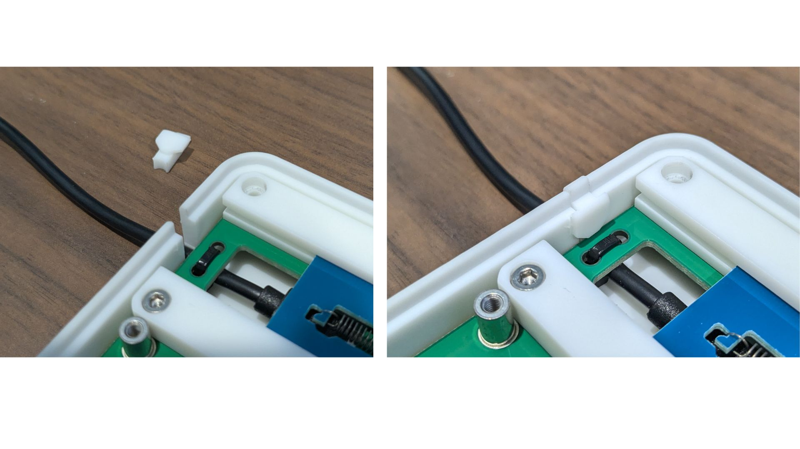

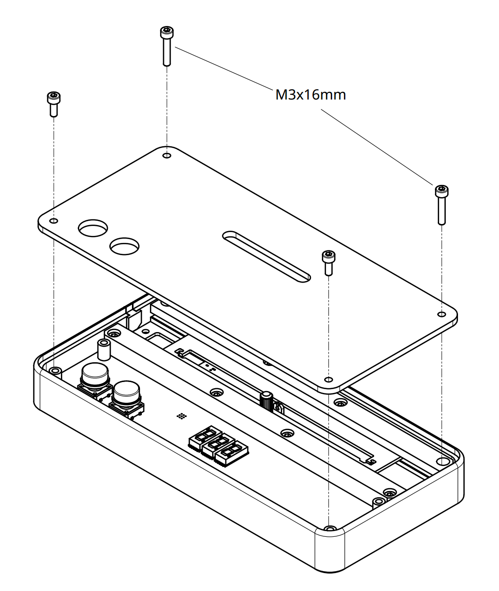

## Conclusion

The mechanical assembly is complete. Check the carriage slides freely and returns near enough to centre to be satisfactory.

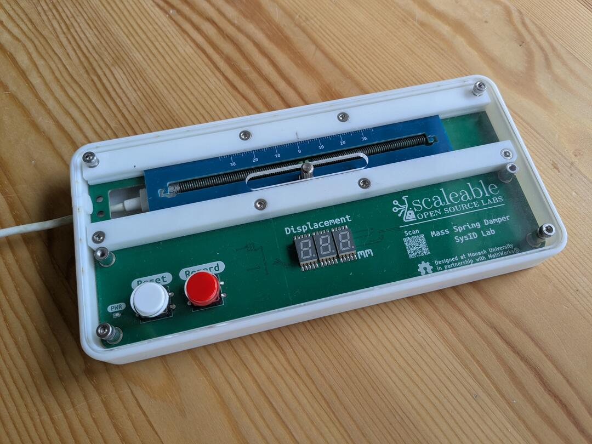

Proceed with the [Programming Instructions](Programming-Instructions.md)
