# JLCPCB Ordering Instructions

This is a step-by-step walkthrough of ordering the two circuit boards, fabricated and assembled, from [JLCPCB](https://jlcpcb.com). For everything else in the build, see [Ordering Instructions](Ordering-Instructions.md).

You place one order per board:

| Board | Soldermask | Silkscreen | Assembly side |
|---|---|---|---|
| Main board | White | Black | Both sides |
| Carriage | Red | White | Bottom side only |

The screenshots below are from a main board order. The carriage follows the same steps; its differences are listed in [Ordering the carriage](#ordering-the-carriage).

JLCPCB changes its ordering pages from time to time, so an option may have moved or been renamed. The settings are what matter.

## 0. Get the fabrication files

Download `main-board-fab-{tag}.zip` and `carriage-fab-{tag}.zip` from the [latest release](https://github.com/Scaleable-Open-Source-Labs/Mass-Spring-Damper-SysID-Lab/releases/latest) and unzip them. Each contains three files you'll upload:

| File | What it is | Uploaded in |
|---|---|---|
| `*.zip` (the gerbers) | The bare board: copper, soldermask, silkscreen, drill | Step 1 |
| `*_bom.csv` | Bill of materials: which real part goes at each designator | Step 6 |
| `*_positions.csv` | Placement (CPL): where each part sits and how it's rotated | Step 6 |

> **Maintainers:** if you've changed the KiCad design, regenerate these files with the KiCad Fabrication Toolkit plugin instead. Never reuse an old `production/` folder, because it may predate a schematic edit.

## 1. Upload the gerbers and set the quantity

On [jlcpcb.com](https://jlcpcb.com), upload the gerber zip. JLCPCB detects a 2-layer board and fills in the dimensions. Set **PCB Qty**.

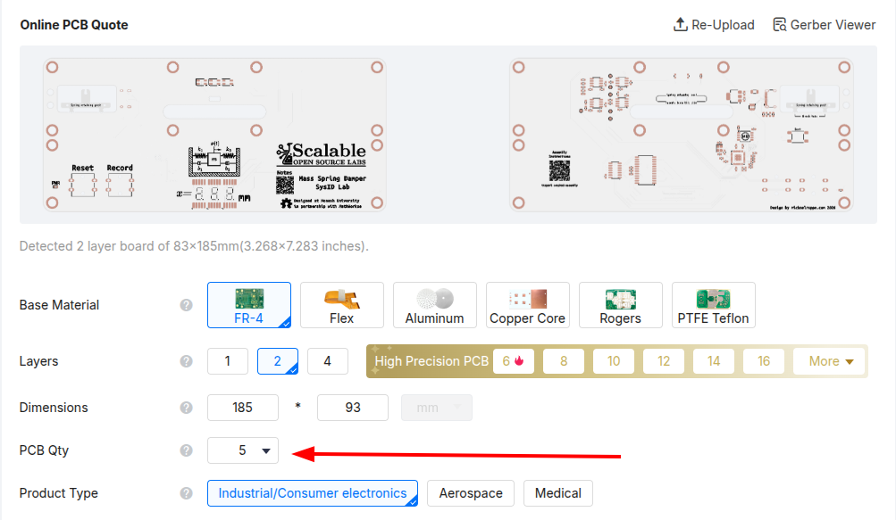

## 2. PCB specifications

Set:

- **PCB Color:** White (main board)
- **Silkscreen:** Black (set automatically with white)
- **Surface Finish:** LeadFree HASL

Leave everything else at its default (FR-4, 2 layers, 1.6mm thickness, Single PCB).

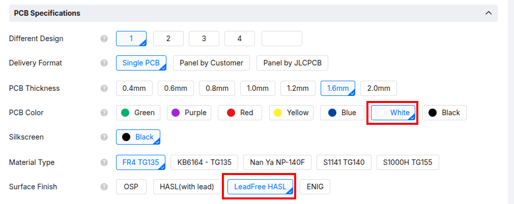

## 3. Turn on PCB assembly

Further down the page, switch on the **PCB Assembly** toggle, then set:

- **PCBA Type:** Standard
- **Assembly Side:** Both Sides (main board)
- **PCBA Qty:** the same as your PCB quantity
- **Edge Rails/Fiducials:** Added by JLCPCB. The board grows slightly with rails on the long sides. This is expected.
- **Parts Selection:** By Customer (Self-Service)

Leave Confirm Parts Placement, Stencil Storage and Fixture Storage at No.

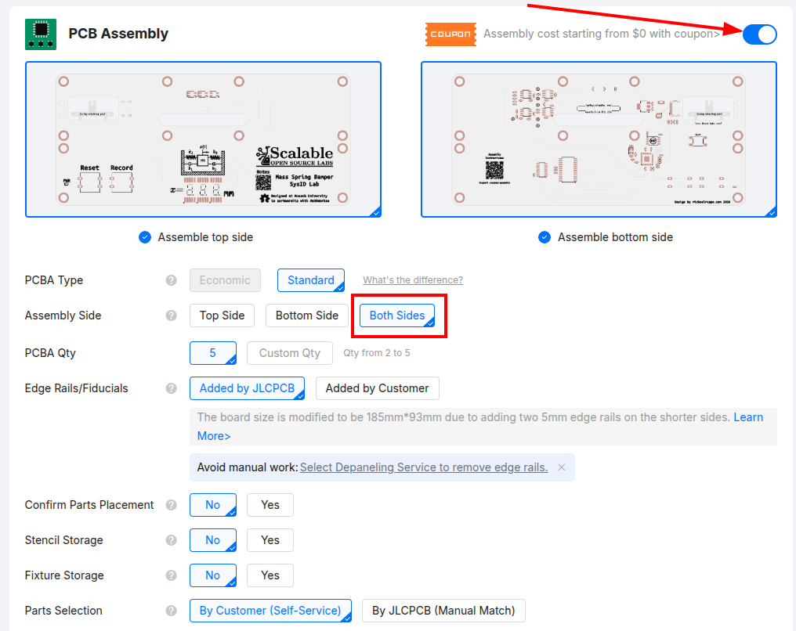

## 4. Advanced options

Set **Depanel boards & edge rail before delivery** to **Yes**. 

**Optional**: Bake Components. The optical components are moisture sensitive (MSL4) and baking may lead to a lower failure-rate. If you select yes to this option, you will need to provide the reference for the three optical parts.

Leave the other advanced options at their defaults, then accept the assembly terms.

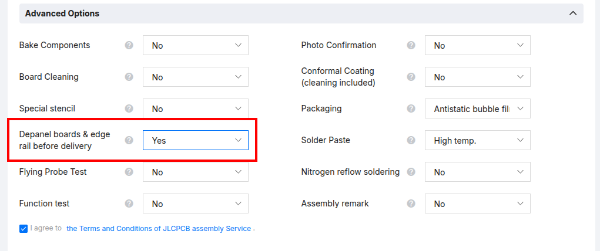

## 5. Check the board render

Click through to the assembly pages. The first page shows a render of the board with a Top/Bottom toggle. Check both sides look right and that the PCBA type, assembly side and quantity match what you chose. Then click **Next**.

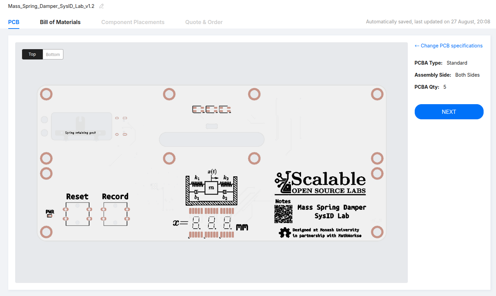

## 6. Upload the BOM and placement files

On the **Bill of Materials** tab, add the `*_bom.csv` as the BOM file and the `*_positions.csv` as the CPL file, then click **Process BOM & CPL**.

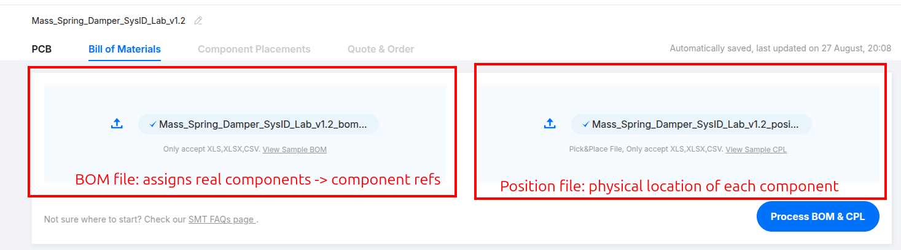

## 7. Review the matched parts

JLCPCB lists every part it matched from your BOM. Check that **every row is ticked** in the Select column. An unticked row is left off the board.

Rows marked with a warning icon need a closer look. On past orders these were the USB-C connector (J1) and the two pushbuttons (SW2, SW3). Hover over the icon to read the warning, and make sure the row is still ticked before you continue.

Reason (USB-C connector): Complicated part requires special handling to place. Ensure box is checked.
Reason (SWitches): Each tactile button shares a different "Value" (Record/Reset) but the same component is assigned. That is fine. Ensure box is checked.

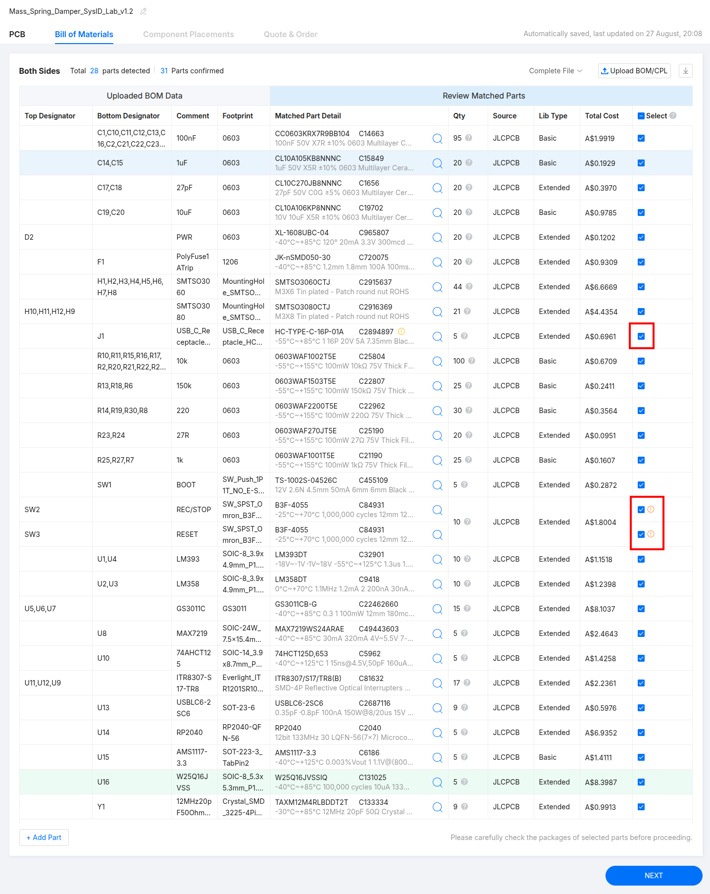

## 8. Check the component placements

This step catches most ordering mistakes. The **Component Placements** tab shows every part sitting on its pads in 3D. Several parts come out **rotated or offset** from where they belong, and JLCPCB assembles exactly what this view shows.

Step through **every part on both sides**. Pay particular attention to parts where orientation matters (ICs, sensors, diodes, connectors), and look for pin 1 markers that don't line up and bodies that overhang their pads. Fix each one before continuing.

The two examples below are from a v1.2 main board order. The parts that need fixing may differ on your board revision, so check them all rather than only these.

### Example: a rotated part

This optical sensor (U11) is placed 180° out: the pin 1 dot on the part is at the opposite end from the footprint's pin 1 marker (the magenta triangle).

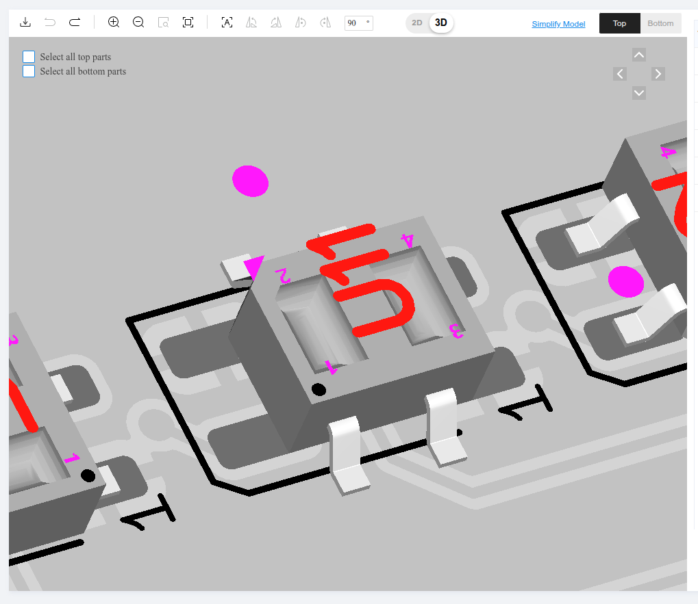

Select the part and use the rotate buttons (boxed) until it lines up with the footprint:

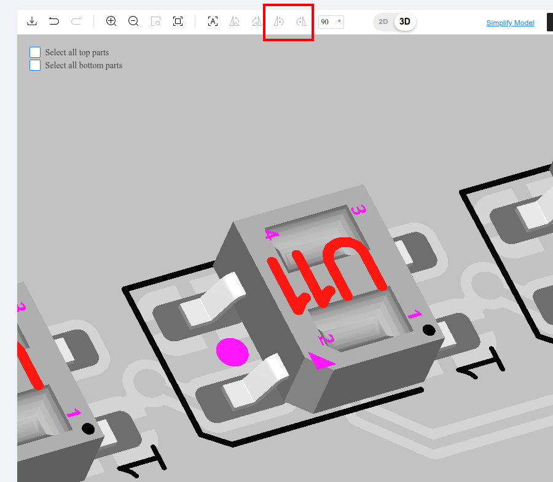

### Example: an offset part

The USB-C connector (J1, bottom side) sits too far right, off its pads:

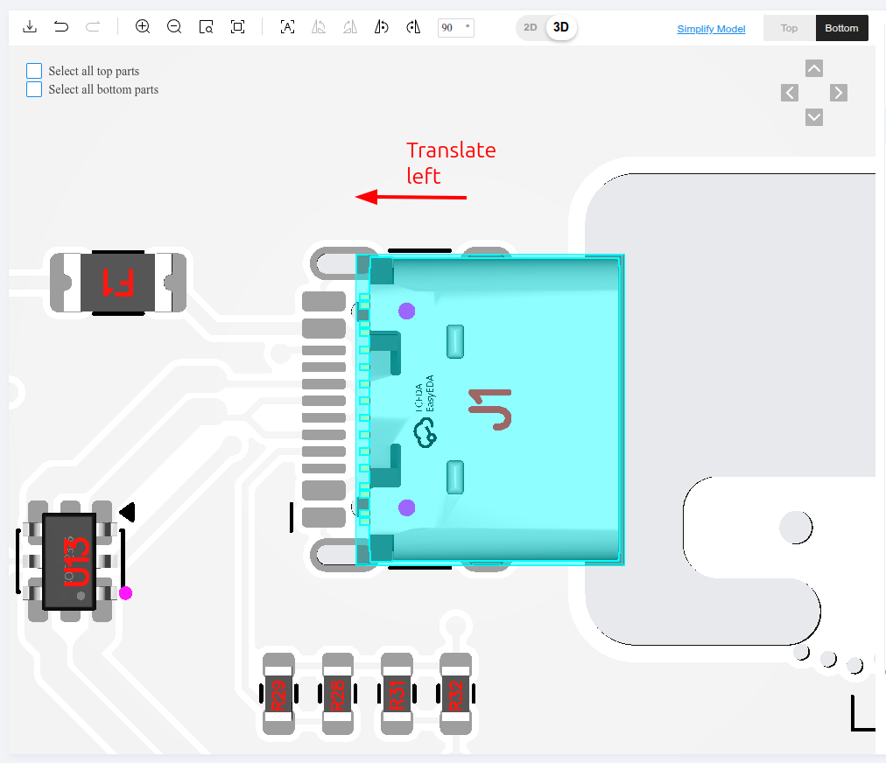

Select it and move it left until its pins sit on the pads:

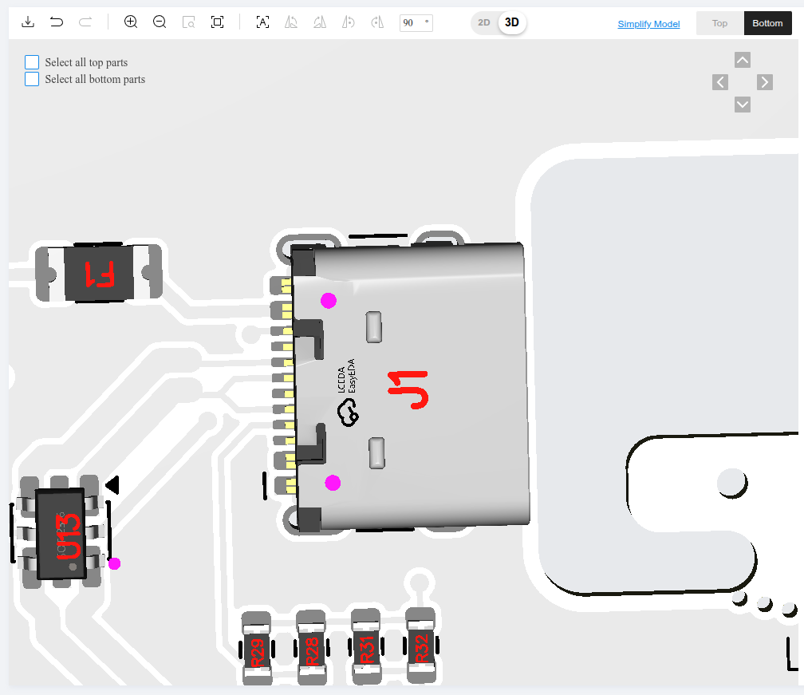

## 9. Quote and order

On the **Quote & Order** tab, review the price breakdown, add the order to your cart, and check out.

## Ordering the carriage

Place a second order for the carriage using the files from `carriage-fab-{tag}.zip`. Follow the same steps, with these differences:

| Step | Main board | Carriage |
|---|---|---|
| 2. PCB Color | White | **Red** |
| 2. Silkscreen | Black | **White** |
| 3. Assembly Side | Both Sides | **Bottom Side** |

Everything else is the same, including depanelling and checking every placement in step 8.
